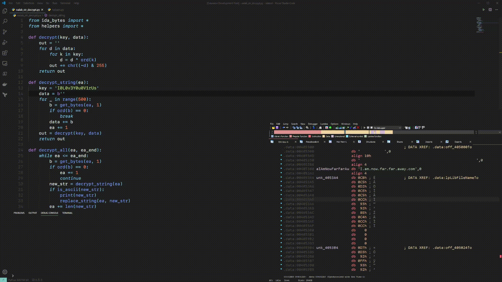

# IDACode
IDACode makes it easy to execute and debug Python 3 scripts in your IDA environment without leaving Visual Studio Code. The VS Code extension can be found on the [marketplace](https://marketplace.visualstudio.com/items?itemName=Layle.idacode).  
IDACode is still in a very early state and bugs are to be expected. Please open a new issue if you encounter any issues.

## Features
* **Speed**: Quickly create and execute scripts.
* **Debugging**: Attach a Python debugger at any time.
* **Compatibility**: IDACode does not require you to modify your scripts in a specific way. All scripts can be executed from within IDA without changes.
* **Modularity**: IDACode does not make extensive use of safe wrappers for thread synchronization, this allows you to import any module from any path at any given time. Instead IDACode synchronizes the script execution thread with IDAs main thread to avoid performance and unexpected issues. 

IDACode only supports Python 3. If there's a need for Python 2 compatibility please vote [here](https://github.com/ioncodes/idacode/issues/3).

## Setup
To set up the dependencies for the IDA plugin run:

```sh
# make sure to use the correct Python version
python3 -m pip install --user debugpy tornado
```

Either clone this repository or download a release package from [here](https://github.com/ioncodes/idacode/releases). `ida.zip` reflects the contents of the `ida` folder in this repository. Copy all files into IDAs plugin directory.  

The next step is to configure your settings to match your environment. Edit `idacode_utils/settings.py` accordingly:

* `HOST`: This is the host address. This is always `127.0.0.1` unless you want it to be accessible from a remote location. **Keep in mind that this plugin does not make use of authentication.**
* `PORT`: This is the port you want IDA to listen to. This is used for websocket communication between IDA and VS Code.
* `DEBUG_PORT`: This is the port you want to listen on for incoming debug sessions.
* `PYTHON`: This is the absolute path to the Python distribution that your IDA setup uses.
* `LOGGING`: Determines whether the debugger should log into files. This is especially useful when you are running into issues with IDACode. Please submit a new issue if you find anything. The files are always located in your temp directory (e.g. Windows: `%TEMP%`). The files are called `debugpy.*.log`.

You can now start the plugin by clicking on `Start IDACode` in the plugins menu.  

The VS Code extension is available on the [marketplace](https://marketplace.visualstudio.com/items?itemName=Layle.idacode). To configure the extension please refer to the extension's [README](https://github.com/ioncodes/idacode/tree/master/idacode#extension-settings).

## Usage

### IDA
Hit `Start IDACode` in the plugin menu. You should be greeted with the following text:

```
IDACode listening on 127.0.0.1:7065
```

### VS Code
There are 4 commands at your disposal:


Once you have a folder open that you want to put your scripts in you are ready to connect to IDA. You can do so by either executing `Connect to IDA` or `Connect and attach a debugger to IDA`. Please keep in mind that a debug session is permanent until you restart IDA. You can not change the workspace folder once the debugger has started.  
Ensure that the workspace folder is the folder that your main scripts are located in.  
Once you are connected you are able to select `Execute script in IDA`.

## Debugging
IDACode uses VS Code's remote debugger to connect to IDA. All VS Code features are supported. However, you have to specify the scripts entrypoint by using Python 3 builtin functionality: `breakpoint`. This instruction tells the debugger to pause execution, if there's no debugger present it will just ignore the function. When executing `breakpoint` in IDA, IDACode gives you additional features such as logging and conditionals which are not present in the normal builtin function. Here's an example:

```py
name = idc.get_segm_name(segment)
breakpoint(name==".text", f"found {name} at {segment}")
```

Please also note that a `breakpoint()` call should never occur at the end of a file, it must always be before any other line of code as it breaks on the _next_ instruction in your code.  
It is also important that attaching a debugger will create a new debugger instance. In most cases this is not what you want. If you disconnect from the debugger use VS Code's remote debugger to connect back.

## Demo


## Contributors
* [mrexodia](https://github.com/mrexodia)